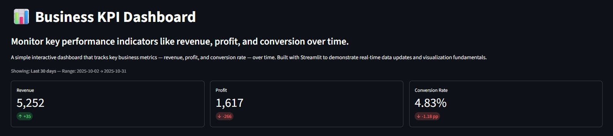
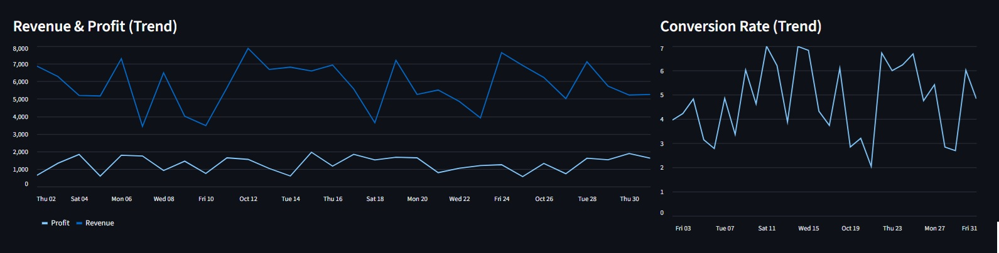
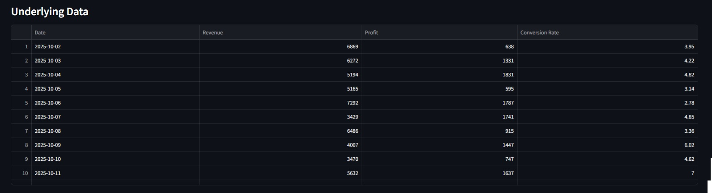

# 📊 Business KPI Dashboard

A lightweight interactive dashboard built with **Streamlit** to visualize key business metrics — **Revenue, Profit, and Conversion Rate** — over time.

This mini-project was designed to showcase how you can create professional-looking dashboards in Streamlit using only **Python, pandas, and NumPy**.

---

## 🚀 Features

- **KPI Cards:** Revenue, Profit, and Conversion Rate with daily deltas
- **Interactive Filtering:** Select between last 7, 14, 30 days, or full range
- **Dynamic Charts:** Auto-updating line charts for key metrics
- **Data Table + CSV Download:** Explore and export underlying data
- **Responsive Layout:** Works on both light and dark themes
- **Sidebar Controls + Regenerate Button:** Quickly refresh mock data

---

## 🧩 Tech Stack

- **Python 3.9+**
- **Streamlit**
- **pandas**
- **NumPy**

---

## 💻 Run Locally

1. **Clone the repository**

   ```bash
   git clone https://github.com/<your-username>/business-kpi-dashboard.git
   cd business-kpi-dashboard
   ```

2. **Install dependencies**

   ```bash
   pip install -r requirements.txt
   ```

3. **Run the app**

   ```bash
   streamlit run app.py
   ```

4. **Open in browser**
   ```
   http://localhost:8501
   ```

---

## 🌐 Live Demo

👉 [View on Streamlit Cloud](https://<your-streamlit-url>.streamlit.app)

---

## 🧠 What You’ll Learn

- Building multi-column layouts with `st.columns()`
- Displaying dynamic KPIs with `st.metric()`
- Using Streamlit widgets (`selectbox`, `button`, `expander`)
- Plotting data with `st.line_chart()`
- Managing interactivity and session state

---

## 📸 Preview

| KPI Row                            | Trend Charts                            | Data Table                            |
| ---------------------------------- | --------------------------------------- | ------------------------------------- |
|  |  |  |

_(Add your own screenshots or a short GIF here!)_

---

## 🧾 License

MIT License © 2025 [Your Name]

---

### 🙌 Connect

If you found this project useful:

- ⭐ Star the repo
- 💬 Comment or share on [LinkedIn](https://linkedin.com/in/ignacio-spreafico)
- 🔗 Fork and adapt it for your own KPI dashboard!
